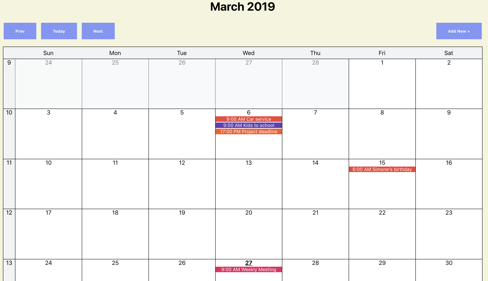

# React reminder calendar

React + redux demo project to make Google like reminder calender. Examples include sharing logic with both render props and react hooks, local ui state vs redux state.

## Features

* Ability to add, edit and remove reminders of specific day and time.
* Allow the user to select a color when creating a reminder.

## Project structure

* **state** root level project state
* **components** contains all reusable presentation components
* **pages/reminders-calendar** contains module to show reminder calendar
  * state: redux state for the module. reducer.js manages the immutable state as it was coming from the database. index.js offers memorized selectors to convert the state to data structures that best serves the presentation components. actions.js lists the possible actions and action creators.
  * components: presentation components specific to this module e.g. reminder form.